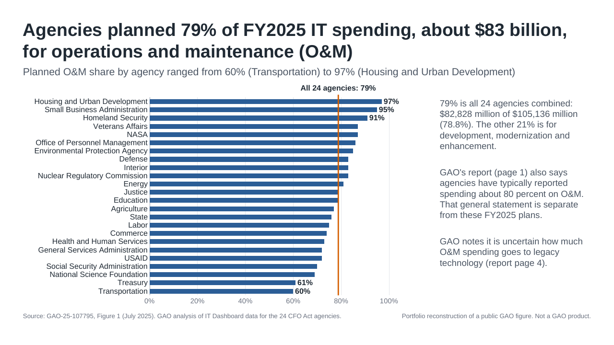
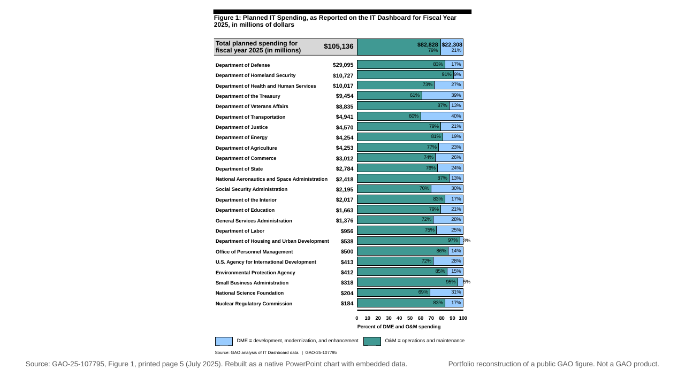
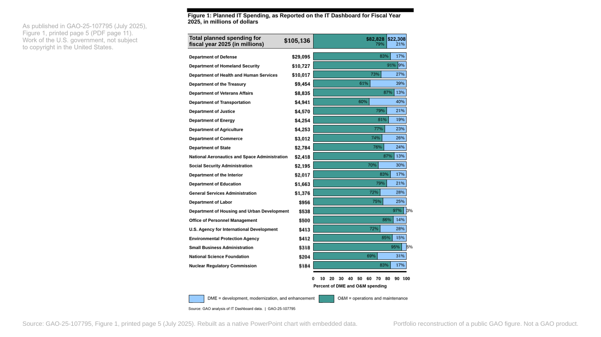

# Chart Rebuilds: GAO's federal IT spending chart

GAO report GAO-25-107795 (July 2025) has a dense figure: planned fiscal year 2025 IT spending for the 24 CFO Act agencies, drawn as 24 bars of operations and maintenance (O&M) against development, modernization and enhancement (DME), with every value printed. This repo rebuilds that figure in PowerPoint twice. The first slide is a faithful rebuild as a native, editable chart. The second is an executive slide built around the figure's one finding.



How this was made: Claude Code agents rebuilt this GAO figure from the source image as editable PowerPoint and drafted the logs. I chose the source, set the rules each rebuild follows, and checked every slide, number and log before publishing.

## The two slides

| | Faithful rebuild | Redesign |
|---|---|---|
| Deck | [`faithful.pptx`](slides/figure1/faithful.pptx), [PDF](slides/figure1/faithful.pdf) | [`redesign.pptx`](slides/figure1/redesign.pptx), [PDF](slides/figure1/redesign.pdf) |
| Chart | One native 100% stacked bar chart with the 48 printed percents embedded, plus a native table for the names and dollar totals | One native bar chart of each agency's O&M share, sorted, with a line at the all-agency 79% |
| Log | [`log-faithful.md`](slides/figure1/log-faithful.md) | [`log-redesign.md`](slides/figure1/log-redesign.md) |
| Compared with GAO's figure | [`overlay.png`](slides/figure1/overlay.png), RMSE 0.1425 on the figure at 300 dpi | |

The faithful rebuild, then the rebuild laid over GAO's figure at 50 percent:





Both charts carry an embedded workbook with the values they were built from, which PowerPoint opens through Edit Data. The inspector reads those workbooks and compares them with `data/figure1.csv`.

## What the checks found

The 24 printed agency totals add up to exactly $105,136 million, the figure's printed grand total.

O&M is $82,828 million of that, or 78.78%. GAO prints it as 79% on the figure and as "about $83 billion (79 percent)" in the text.

GAO drew every bar from its rounded whole percent: all 24 bars measure within 0.07 points of their labels. Agencies that share a printed share therefore cannot be ranked from the figure, so the redesign keeps GAO's order (largest total first) for those ties.

The report also says agencies "have typically reported spending about 80 percent" on O&M. That is a general statement. Both slides use the FY2025 figure, and the redesign's notes keep the two apart, along with GAO's caveat that it is uncertain how much O&M spending goes to legacy technology.

Every value was transcribed four times (two readings by eye from two different copies of the figure, an OCR pass, and a separate agent's transcription). The 75 values disagreed once: OCR read 91% as 21%, and a zoom settled it. Details are in [`checks.md`](checks.md) (15 checks), [`data/transcription/compare.md`](data/transcription/compare.md) and [`data/inspect.json`](data/inspect.json) (36 inspector checks).

## Files

| Path | What it is |
|---|---|
| `data/figure1.csv` | Every value printed on the figure, with where it is printed and how the passes agreed |
| `data/transcription/` | The four transcription passes, their comparison, and the zoom that settled the one disagreement |
| `checks.md` | Arithmetic, rounding, bar-pixel and order checks, written by `src/checks.py` |
| `slides/figure1/` | Both decks with PDF and PNG renders, the source image placed as on the slide, the overlay and the two logs |
| `source/` | GAO's figure and report page as published, verbatim quotes, and hashes (`SOURCE.md`) |
| `src/` | The generators and checks listed below |
| `data/*.json`, `data/palette-check.txt` | Saved outputs of the checks, which the logs quote |
| `portfolio.json` | The entry the portfolio site reads |

## How to rebuild

Requirements: Node 20 or later, Python 3.12, LibreOffice, poppler (pdftoppm, pdffonts), ImageMagick 7 and tesseract. `src/make_overlay.py` expects Arial at the macOS path `/System/Library/Fonts/Supplemental/Arial.ttf`.

```sh
npm install
python3.12 -m venv .venv && .venv/bin/pip install python-pptx

# Data and checks
.venv/bin/python src/ocr_pass.py source/gao-25-107795-figure1-masked-1500x1896.png data/transcription/pass-c-ocr.csv
.venv/bin/python src/compare_passes.py
.venv/bin/python src/make_figure1_csv.py
.venv/bin/python src/checks.py

# Decks, generated with PptxGenJS from data/figure1.csv
node src/build-faithful.js
node src/build-redesign.js

# Renders: headless LibreOffice to PDF, then an exact 1280 x 720 raster
soffice --headless --convert-to pdf --outdir scratch/render-faithful slides/figure1/faithful.pptx
src/publish_render.sh scratch/render-faithful faithful slides/figure1
soffice --headless --convert-to pdf --outdir scratch/render-redesign slides/figure1/redesign.pptx
src/publish_render.sh scratch/render-redesign redesign slides/figure1
cp slides/figure1/redesign.png renders/cover.png

# Overlay, measurements, inspection and the portfolio entry
.venv/bin/python src/make_overlay.py
.venv/bin/python src/fit_offsets.py scratch/overlay/fig-src-300.png scratch/overlay/fig-reb-300.png data/fit-offsets.json
.venv/bin/python src/check_reference_line.py
.venv/bin/python src/inspect_decks.py
.venv/bin/python src/test_inspector.py
.venv/bin/python src/make_portfolio.py
node src/validate_portfolio.mjs
```

| Script | Does |
|---|---|
| `src/ocr_pass.py` | Transcription pass C: finds the 24 rows by color and OCRs each one |
| `src/compare_passes.py` | Compares the four passes value by value and fails on any unresolved disagreement |
| `src/make_figure1_csv.py` | Writes `data/figure1.csv` from the reconciled transcription |
| `src/checks.py` | Sums, shares, rounding, bar pixels, order and ties, written to `checks.md` |
| `src/build-faithful.js`, `src/build-redesign.js`, `src/lib.js` | Generate the two decks |
| `src/publish_render.sh` | Copies a rendered PDF and rasterizes it at exactly 1280 x 720 |
| `src/make_overlay.py` | Places GAO's figure where the rebuild sits, blends the two and measures RMSE |
| `src/fit_offsets.py` | Measures how far each element of the rebuild sits from GAO's, in pixels at 300 ppi |
| `src/check_reference_line.py` | Measures where the redesign's reference line landed in the render |
| `src/inspect_decks.py`, `src/test_inspector.py` | python-pptx inspection of both decks against the CSV, and a test that it catches broken decks |
| `src/make_portfolio.py`, `src/validate_portfolio.mjs` | Write the logs and `portfolio.json`, and validate it against the portfolio site's contract |

## Limits

No step in this build opened the decks in Microsoft PowerPoint. They were generated with PptxGenJS, checked with python-pptx, and rendered with LibreOffice, so text positions in PowerPoint are unchecked. Each file's properties name PptxGenJS as the application and say Claude Code agents generated it.

The PDFs and PNGs use Liberation Sans, which LibreOffice substitutes for Arial. Widths and line breaks match, and glyph shapes differ slightly.

The redesign's reference line is a drawn shape at the computed 78.78% position. It does not move if the chart data change. The faithful slide's two outside labels (3% and 5%) are text boxes for the same reason given in its log.

## Credits and licenses

Source: GAO, Information Technology: Agencies Need to Plan for Modernizing Critical Decades-Old Legacy Systems, GAO-25-107795 (Washington, D.C.: July 17, 2025), Figure 1, https://www.gao.gov/products/gao-25-107795. It is a work of the U.S. government and is not subject to copyright protection in the United States. See [`CREDITS.md`](CREDITS.md).

Code is under the MIT license ([`LICENSE`](LICENSE)). The slides, logs, text and images made for this repo are under CC BY 4.0 ([`LICENSE-content`](LICENSE-content)). GAO's figure and report text are public, as above.

Portfolio reconstruction of a public GAO figure. Not a GAO product. Not affiliated with or endorsed by GAO.
